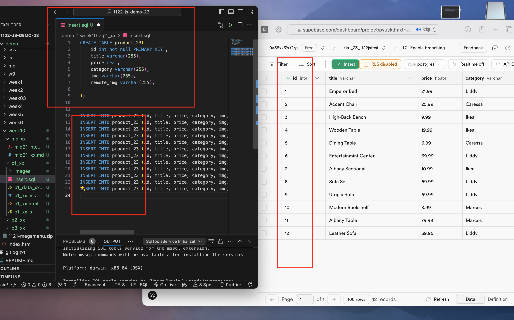
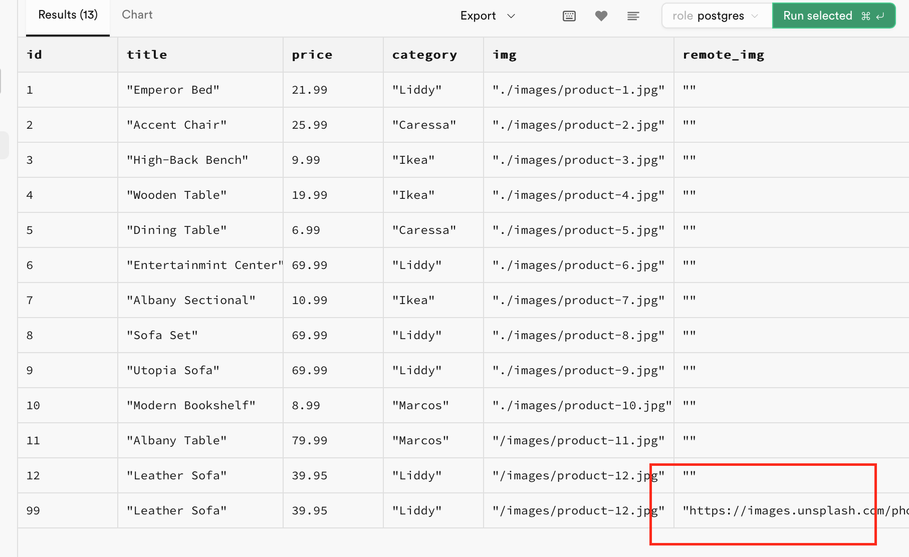
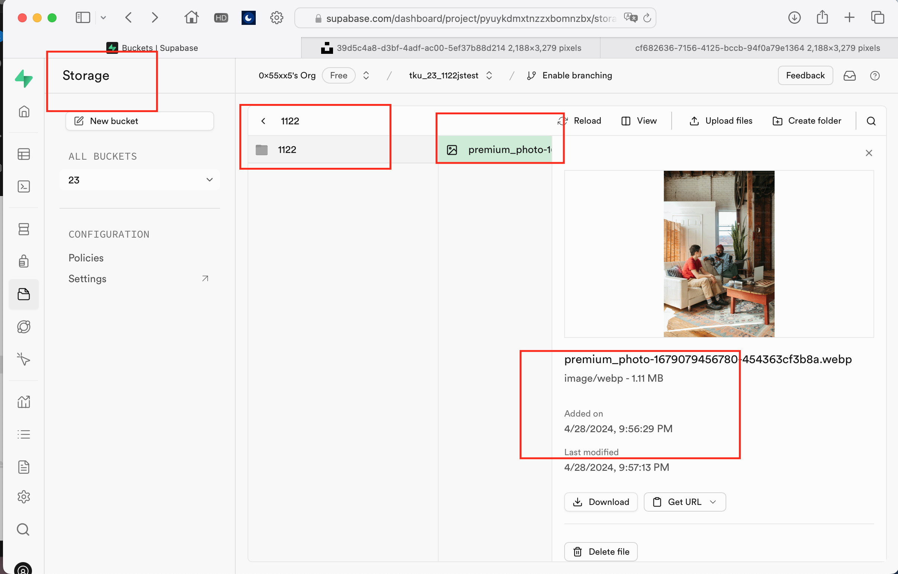
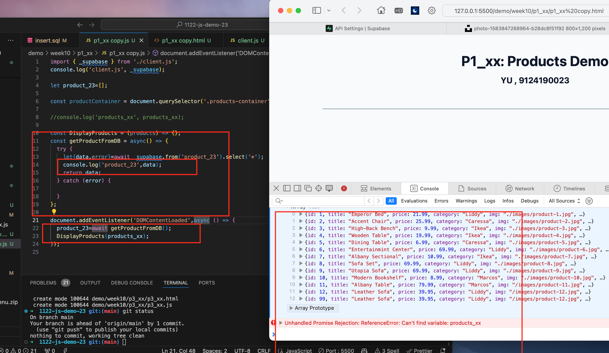
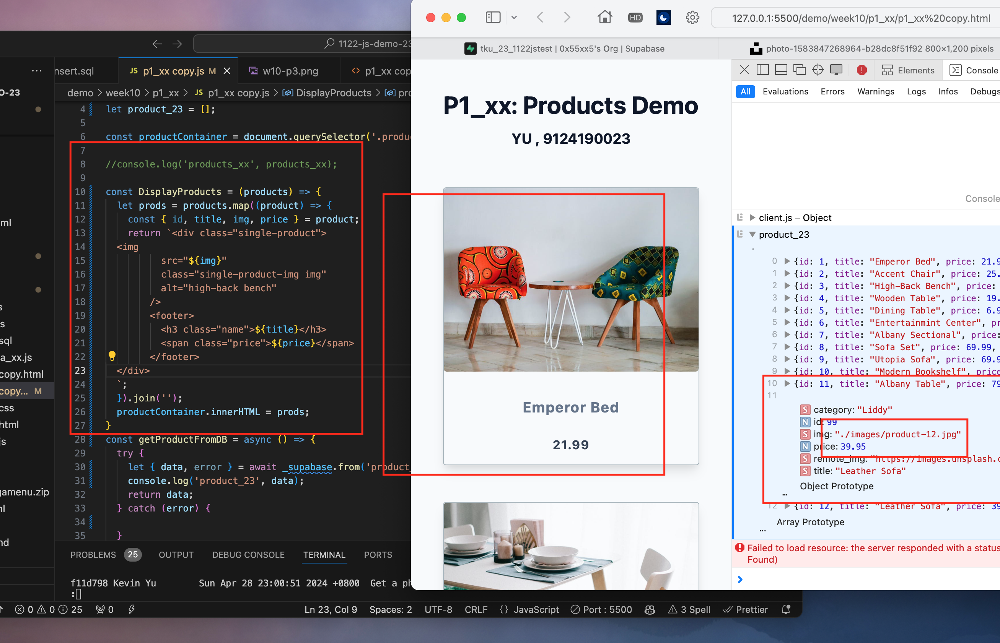

GITHUB :

[My github repo url 912410023](https://github.com/0x55xx5/1122-js-demo-23)

[My Vercel url 912410023](https://1122-js-demo-23.vercel.app/demo/index.html)

### W10-P1: In Supabase, create product_xx table with 8 product data
 

 
```
e71e3fb Kevin Yu        Sun Apr 28 21:53:13 2024 +0800  In Supabase, create product_xx table with 8 product data

```
 
###  W10-P2: Get a photo from unsplash, and put it into storage in Supabase
 

 

 
```
f11d798 Kevin Yu        Sun Apr 28 23:00:51 2024 +0800  Get a photo from unsplash, and put it into storage in Supabase \n W10-P3: Get
 9 products data from Supabase, and show in console
```


### W10-P3: Get 9 products data from Supabase, and show in console
 

 
```
f11d798 Kevin Yu        Sun Apr 28 23:00:51 2024 +0800  Get a photo from unsplash, and put it into storage in Supabase \n W10-P3: Get
 9 products data from Supabase, and show in console
```

### W10-P4: Show products retrieved from Supabase
 

 
```
b8efe97 Kevin Yu        Sun Apr 28 23:20:25 2024 +0800  w10-p4.png
```

### git log

```

b8efe97 Kevin Yu        Sun Apr 28 23:20:25 2024 +0800  w10-p4.png
f11d798 Kevin Yu        Sun Apr 28 23:00:51 2024 +0800  Get a photo from unsplash, and put it into storage in Supabase \n W10-P3: Get 9 products data from Supabase, and show in console
e71e3fb Kevin Yu        Sun Apr 28 21:53:13 2024 +0800  In Supabase, create product_xx table with 8 product data
```