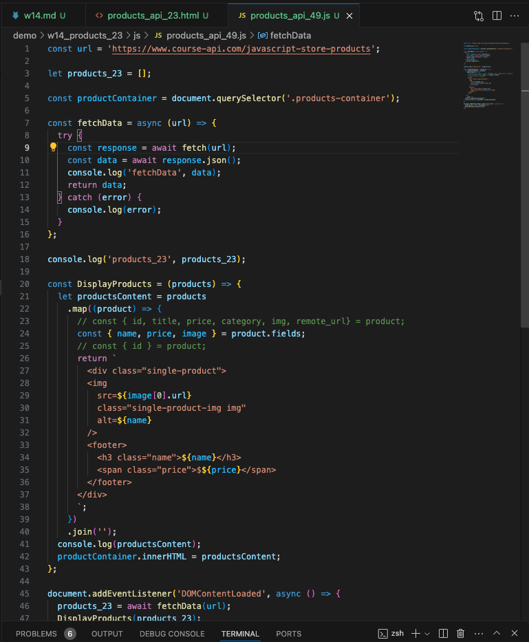
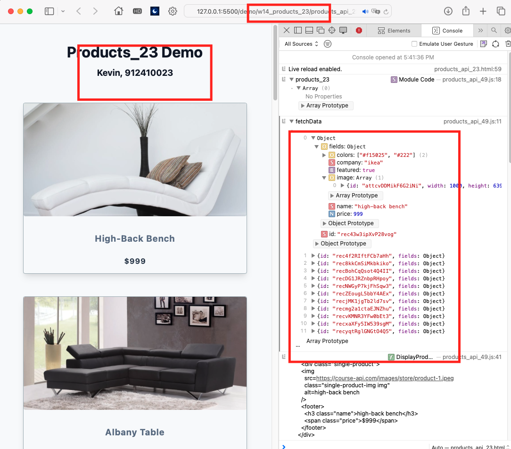
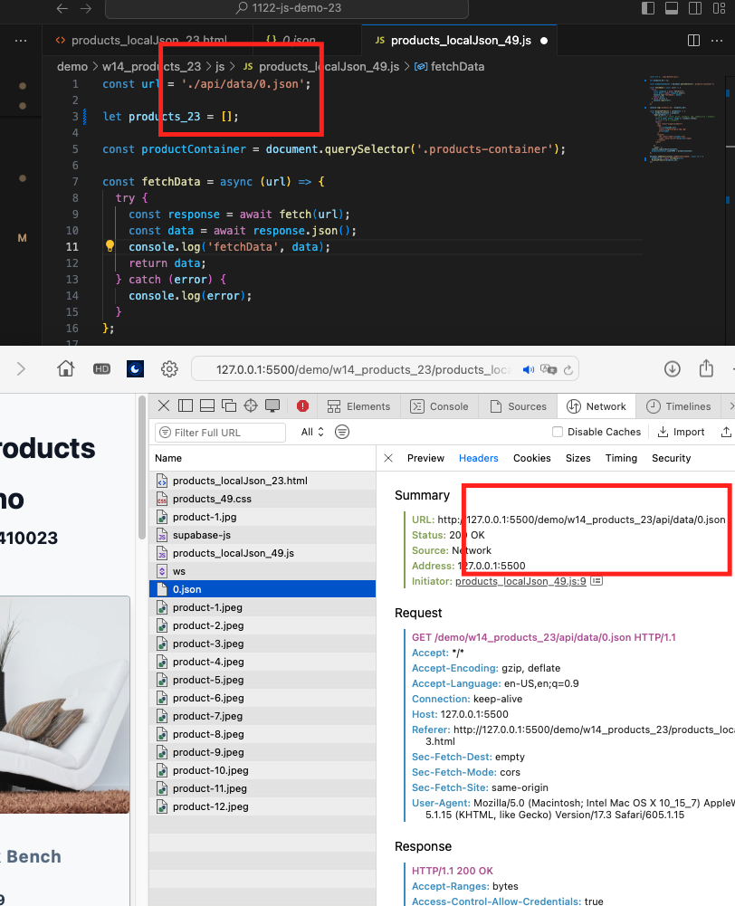
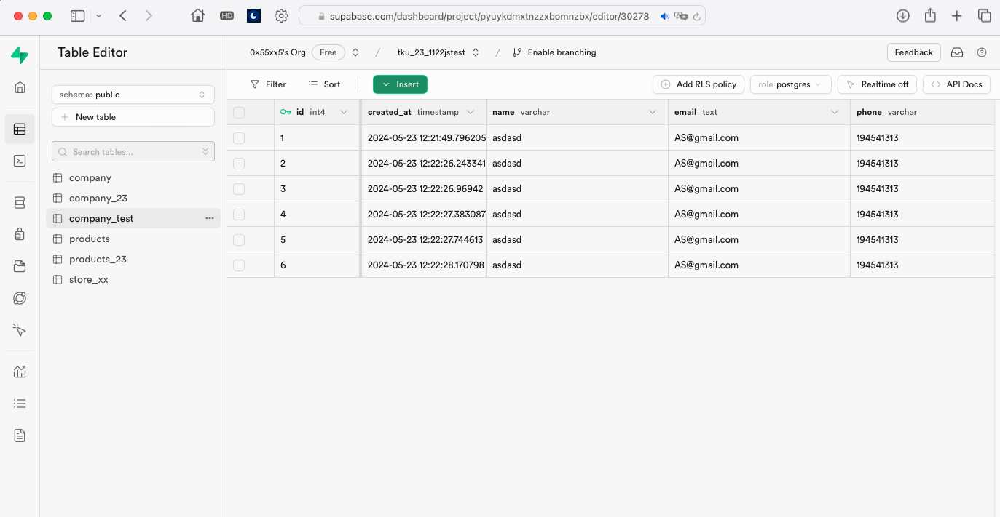
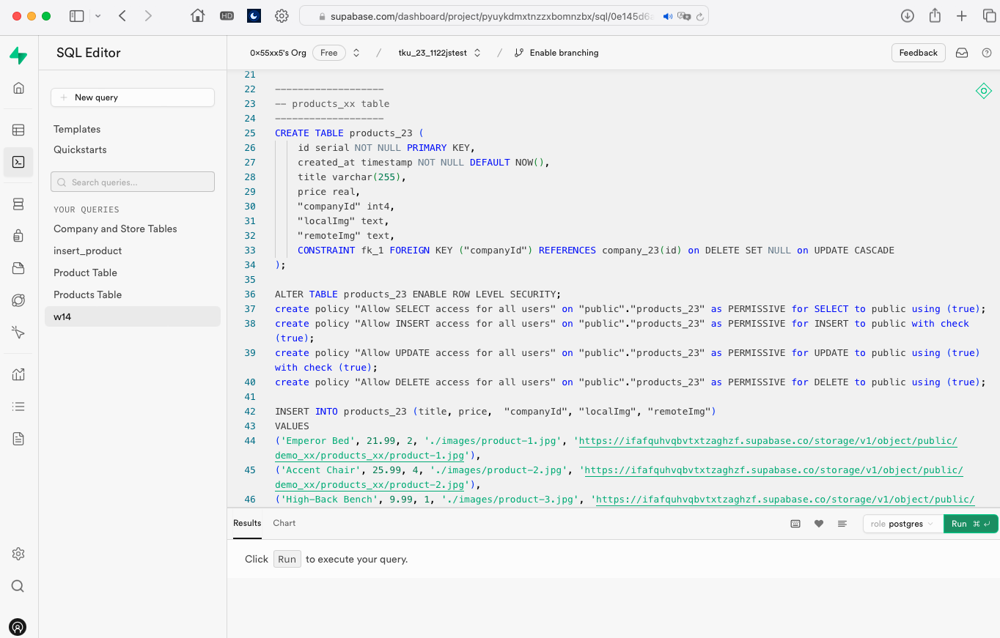
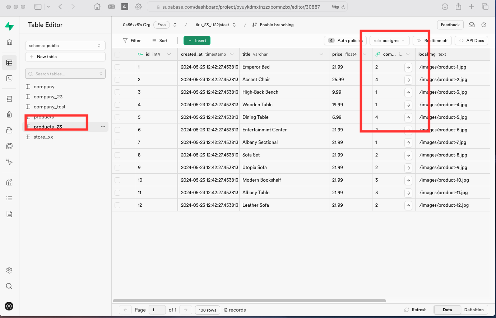
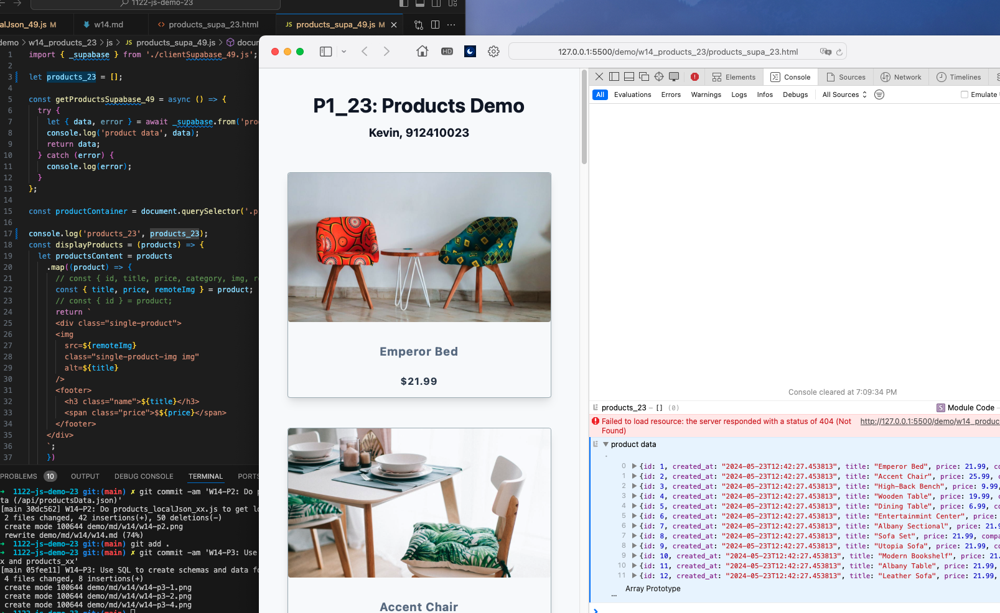

GITHUB :

[My github repo url 912410023](https://github.com/0x55xx5/1122-js-demo-23)

[My Vercel url 912410023](https://1122-js-demo-23.vercel.app/demo/index.html)

#### W14-P1: Do products_api_xx.js to get data from an api url
 

 


```

```

#### W14-P2: Do products_localJson_xx.js to get local json data (/api/productsData.json)
 

 
```

```
#### W14-P3: Use SQL to create schemas and data for company_xx and products_xx
 
#### => company_xx schema and data
 

 

 
#### => products_xx schema and data
 

 

 
```

```

#### W14-P4: Do products_supa_xx.js to get data from Supabase
 

 
```
a922434 htchung Thu May 23 21:01:09 2024 +0800  14-P4: Do products_supa_xx.js to get data from Supabase
```
 
---
