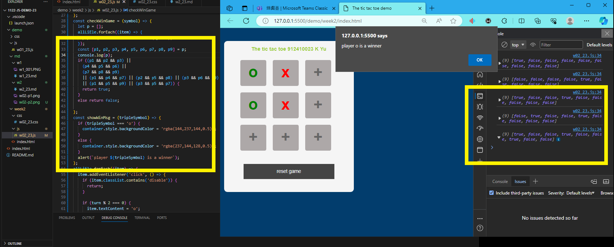
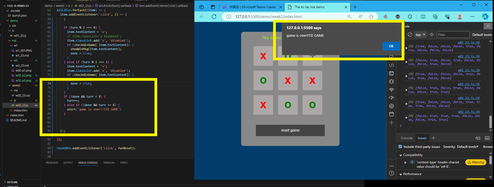

GITHUB :

[My github repo url 912410023](https://github.com/0x55xx5/1122-js-demo-23)

[My Vercel url 912410023](https://1121-sweb-demo-912410023.vercel.app/)
### W02-P1: Show Tictactoe css
 

 

```
7f6984b 912410023       Thu Feb 29 19:34:02 2024 +0800  ### W02-P1: Show Tictactoe css
```


 
```
1861fce 912410023       Thu Feb 29 21:26:58 2024 +0800  Video: ### W02-P2: implement reset button
```

### W02-P3: implment checkWin(player), and winMessage(player)
 
 #### => player o wins

 
```
ab81eb9 912410023       Thu Feb 29 21:28:59 2024 +0800  W02-P3: implment checkWin(player), and winMessage(player)
```
 #### => player TIE  GAME

 
```
ab81eb9 912410023       Thu Feb 29 21:28:59 2024 +0800  W02-P3: implment checkWin(player), and winMessage(player)
```
 #### => player x wins

 
```
ab81eb9 912410023       Thu Feb 29 21:28:59 2024 +0800  W02-P3: implment checkWin(player), and winMessage(player)
```

 #### => git logs for week 02
 ```
$ git log --pretty=format:"%h%x09%an%x09%ad%x09%s" --after="2024-02-28"
ab81eb9 912410023       Thu Feb 29 21:28:59 2024 +0800  W02-P3: implment checkWin(player), and winMessage(player)
1861fce 912410023       Thu Feb 29 21:26:58 2024 +0800  Video: ### W02-P2: implement reset button
7f6984b 912410023       Thu Feb 29 19:34:02 2024 +0800  ### W02-P1: Show Tictactoe css

 ```
