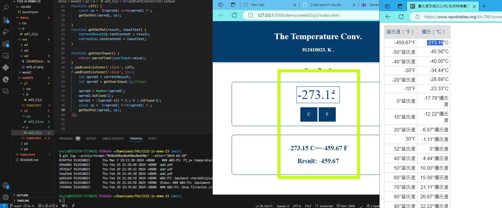
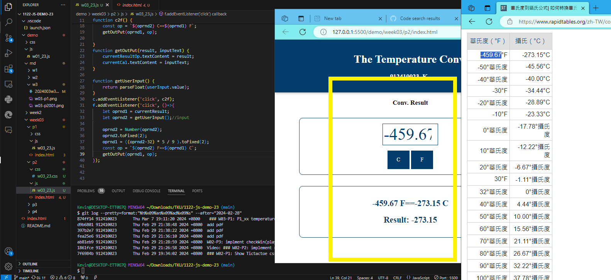
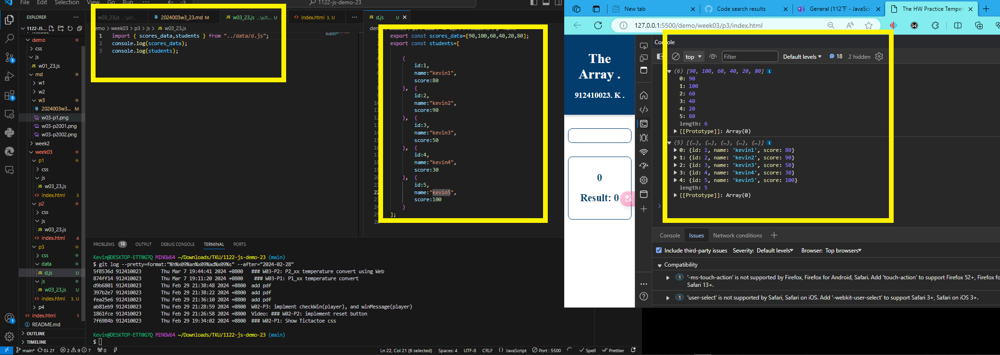
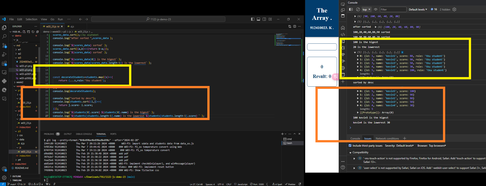

GITHUB :

[My github repo url 912410023](https://github.com/0x55xx5/1122-js-demo-23)

[My Vercel url 912410023](https://1121-sweb-demo-912410023.vercel.app/)
### W03-P1: Show Temperature Conv.
 

 

```
874ff14 912410023       Thu Mar 7 19:11:20 2024 +0800    ### W03-P1: P1_xx temperature convert
```
##### => From C to F

 
 ##### => From F to C


```
5f8536d 912410023       Thu Mar 7 19:44:41 2024 +0800   ### W03-P2: P2_23 temperature convert using Web
```


 ## W03-P3: import sdata and students data from data_xx.js



```
194fc89 912410023       Thu Mar 7 20:11:26 2024 +0800     W03-P3: import sdata and students data from data_xx.js

```

## W03-P4: Compute highest and lowest score of sdata and students2
```

```




 #### => git logs for week 03
 ```
$ git log --pretty=format:"%h%x09%an%x09%ad%x09%s" --after="2024-02-28"

 ```
