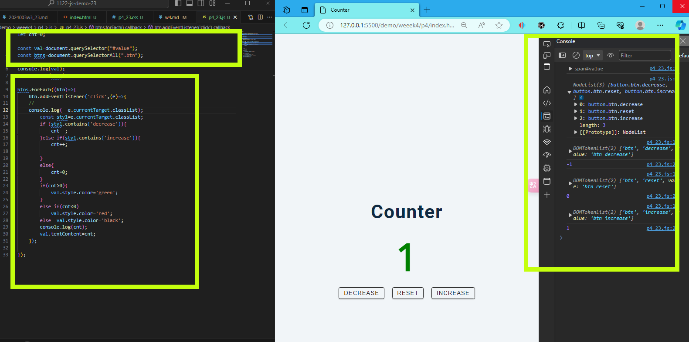
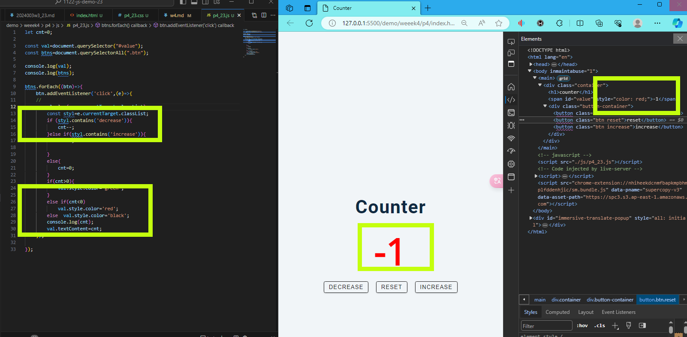
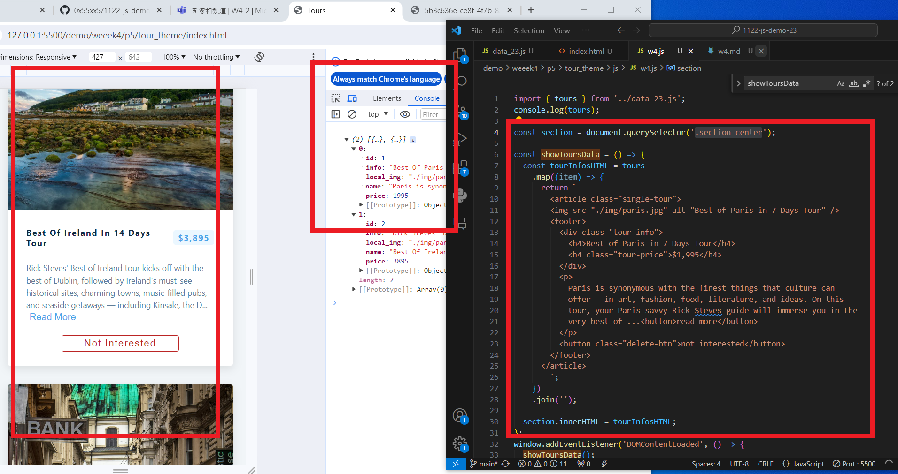
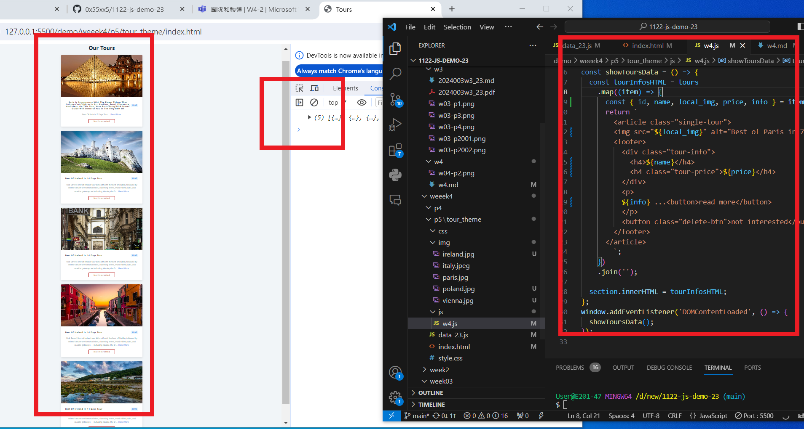
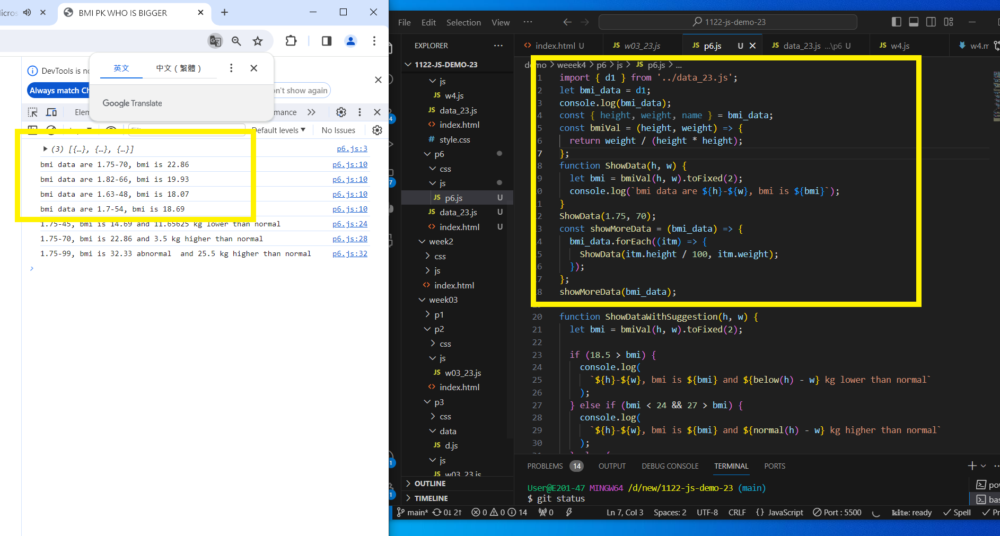
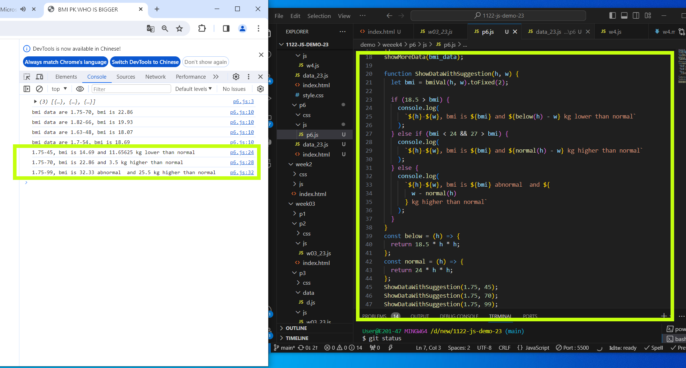

GITHUB :

[My github repo url 912410023](https://github.com/0x55xx5/1122-js-demo-23)

[My Vercel url 912410023](https://1121-sweb-demo-912410023.vercel.app/)

### W04-P1: P4_xx -- Counter Demo
 

 

```
62a1891 912410023       Sun Mar 17 19:53:41 2024 +0800  W04-P1: P4_xx -- Counter Demo
```

### W04-P2: P5_23 -- Tours display two fixed data



```
8a105aa Your Name       Thu Mar 14 20:01:43 2024 +0800  W04-P2: P5_23 -- Tours display two fixed data
```

## W04-P3: P5_23 -- Display 5 tours from data_23.js (json array)



```
6b52fe2 Your Name       Thu Mar 14 20:15:35 2024 +0800  W04-P3: P5_23 -- Display 5 tours from data_23.js (json array)

```

## W04-P4: P6_xx -- BMI Compute with Suggestion

#### => bmiDataCalc(bmi_data_xx);



#### => bmiDataCalcSuggestion(bmi_data_xx);



#### => git logs for week 04

```
$ git log --pretty=format:"%h%x09%an%x09%ad%x09%s" --after="2024-02-28"
9b68eae Your Name       Thu Mar 14 21:20:15 2024 +0800  W04-P4: P6_xx -- BMI Compute with Suggestion
6b52fe2 Your Name       Thu Mar 14 20:15:35 2024 +0800  W04-P3: P5_23 -- Display 5 tours
from data_23.js (json array)
8a105aa Your Name       Thu Mar 14 20:01:43 2024 +0800  W04-P2: P5_23 -- Tours display two fixed data
```
