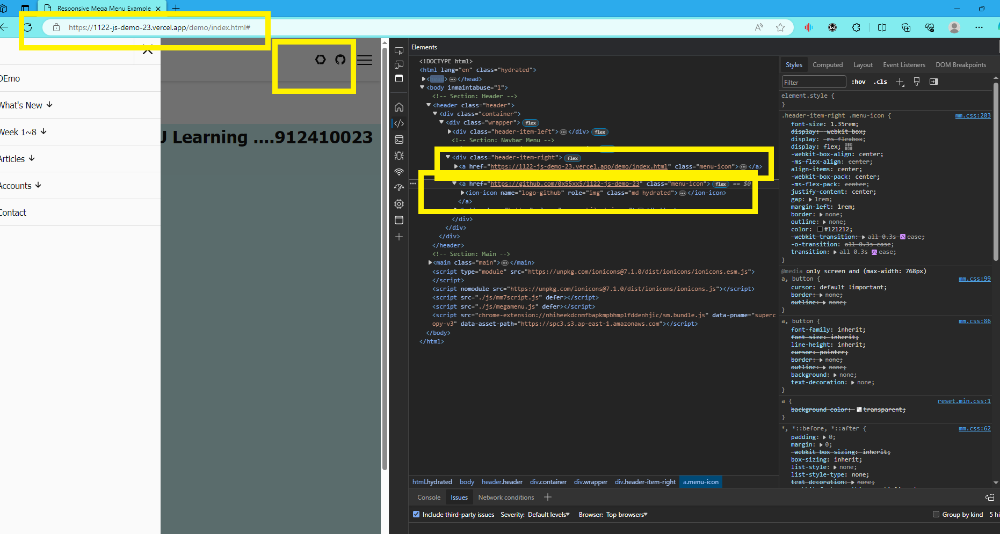
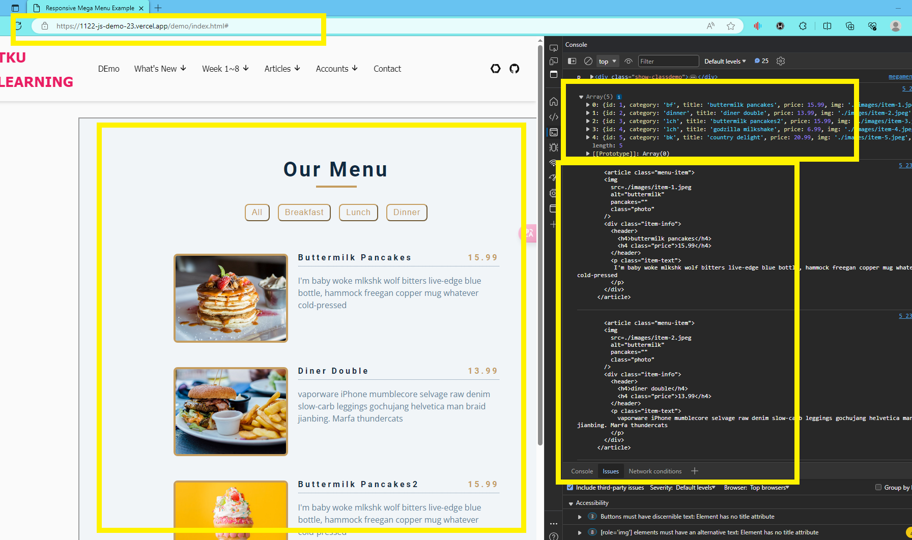

GITHUB :

[My github repo url 912410023](https://github.com/0x55xx5/1122-js-demo-23)

[My Vercel url 912410023](https://1122-js-demo-23.vercel.app/)

### W05-P1: Use megamenu to show class demo w1~W4 locally


```
07a7f63 912410023       Sun Mar 24 21:23:53 2024 +0800  W05-P1: Use megamenu to show class demo w1~W4 locally
```

### W05-P2: Show W05-P1 in Vercel, add github and globe icons for Github and Vercel



```

```

### W05-P3: Display Menu Items from menu json array on both local and Vercel



#### > Vercel


```

```

#### => git logs for week 04

```
$ git log --pretty=format:"%h%x09%an%x09%ad%x09%s" --after="2024-02-28"

```
