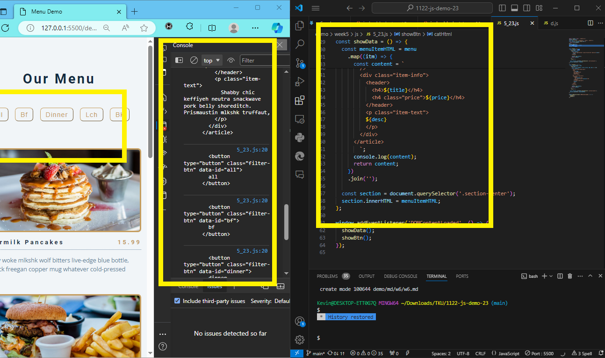
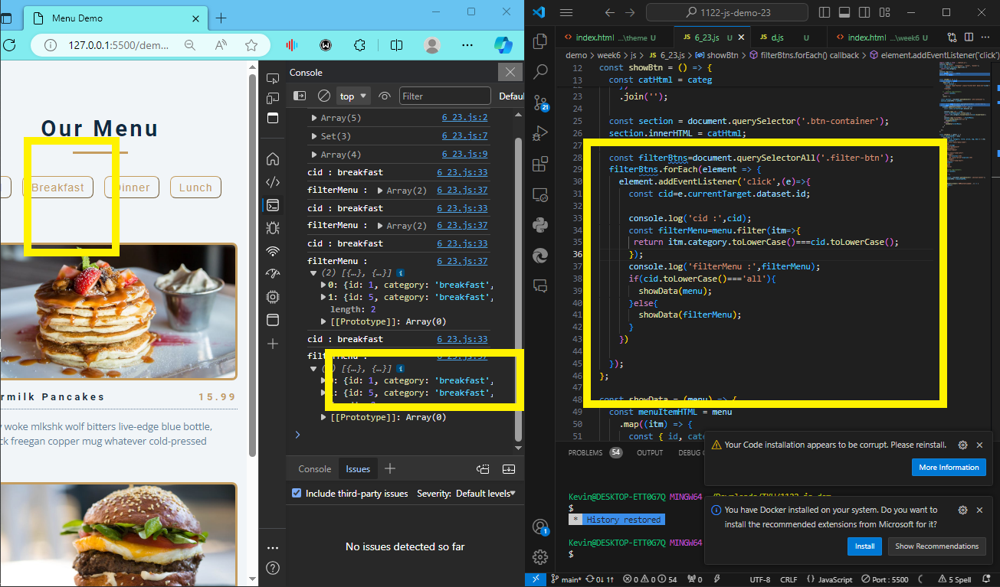
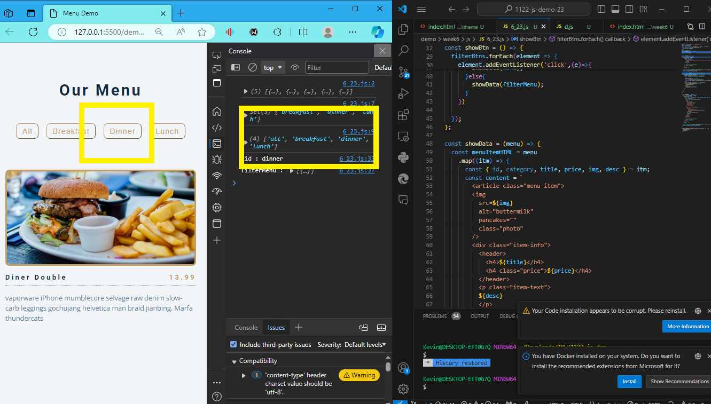
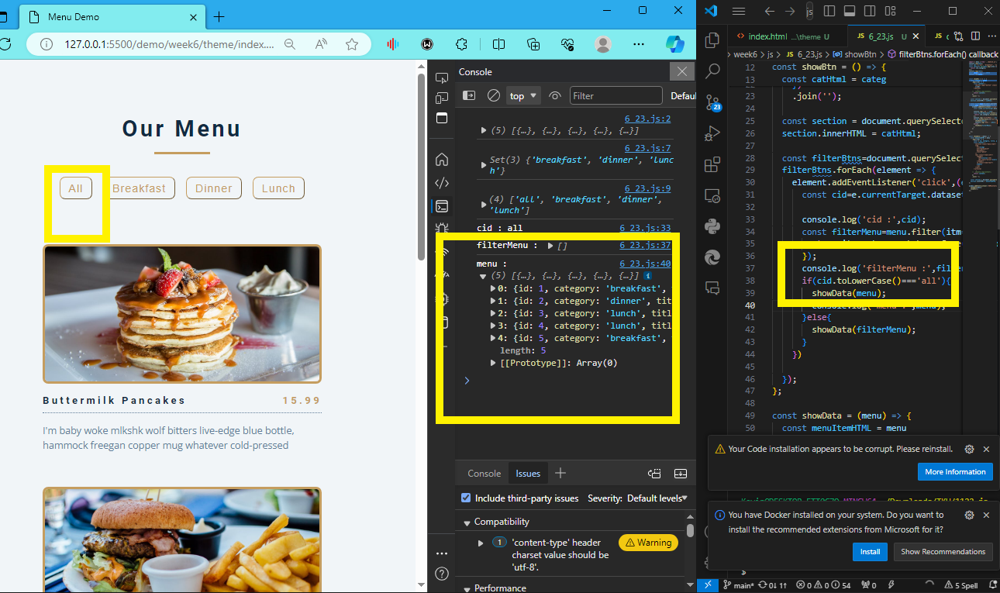
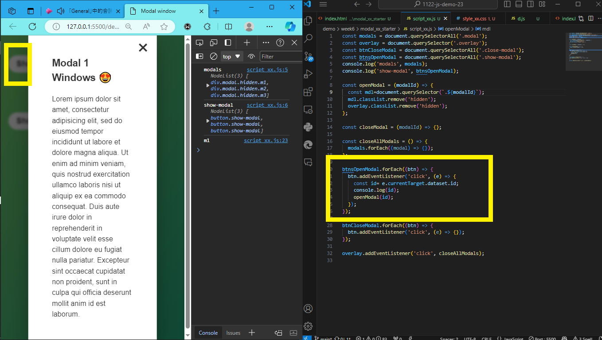
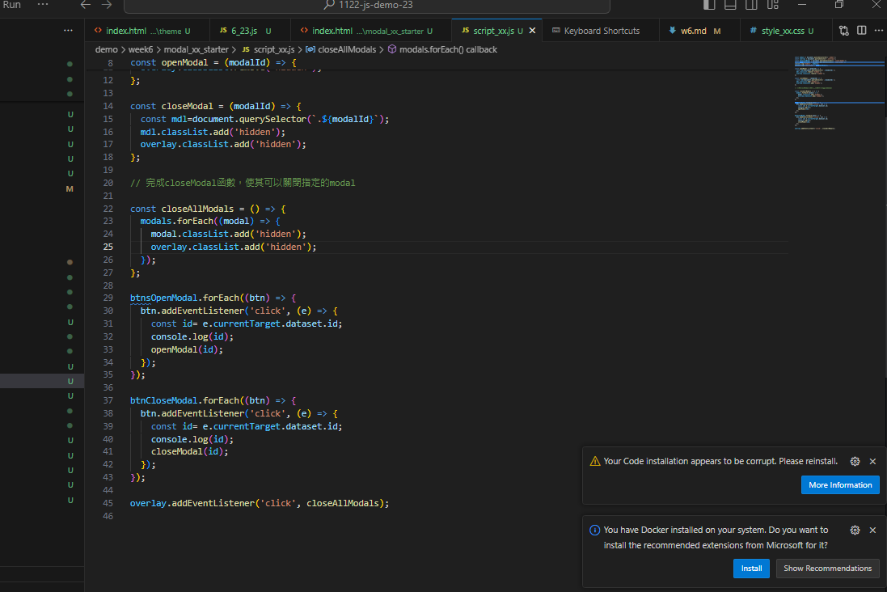

GITHUB :

[My github repo url 912410023](https://github.com/0x55xx5/1122-js-demo-23)

[My Vercel url 912410023](https://1122-js-demo-23.vercel.app/demo/index.html)

### W06-P1: Create categories dynamically from data_xx.js


```

```

### W06-P2: Display Menu buttons from categories array


```

```






### W06-P4: implement open modals
 




### W06-P5: implement close modals



